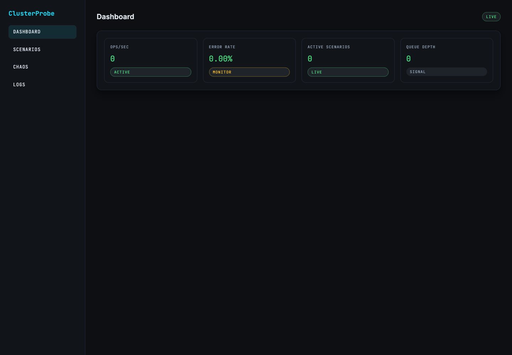
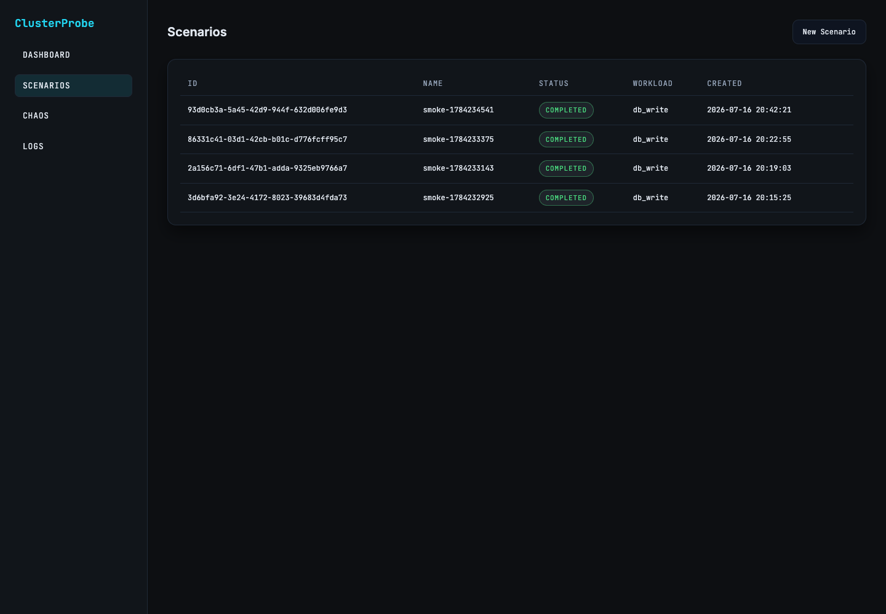
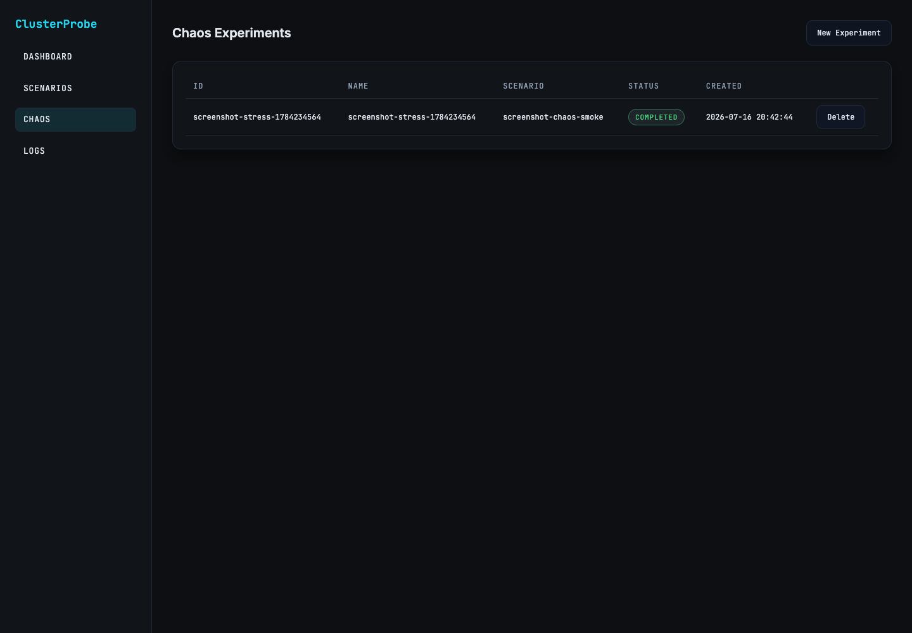
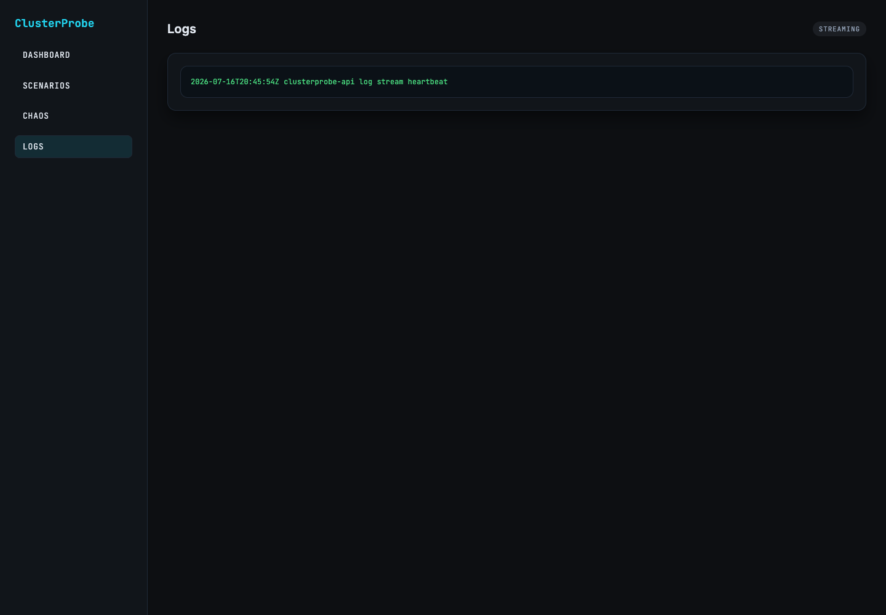

# ClusterProbe User Guide

This guide explains how to deploy ClusterProbe locally, open the UI, run
workload scenarios, apply chaos experiments, inspect logs, validate the system,
and verify release images.

ClusterProbe is designed for Kubernetes validation work. It runs a full local
stack with API, UI, Worker, RabbitMQ, Postgres, Redis, MongoDB, observability
components, and Chaos Mesh.

## What You Can Do

- Create synthetic workload scenarios.
- Run CPU, memory, DB write, DB read, and mixed workloads.
- Watch scenario lifecycle status in the UI.
- Stop active scenarios and cancel in-flight Worker execution.
- Apply Chaos Mesh experiments through the API or UI.
- Confirm API, Worker, UI, logs, and metrics remain healthy during tests.
- Run a full local Kubernetes validation suite.
- Verify built release images and OCI provenance labels.

## Prerequisites

Install these tools before running the full local workflow:

```bash
brew install colima docker kubectl helm jq node
npm install
```

Install Chromium for Playwright UI smoke tests:

```bash
brew install --cask chromium
```

If Chromium is installed somewhere else, set:

```bash
export CHROMIUM_EXECUTABLE_PATH=/Applications/Chromium.app/Contents/MacOS/Chromium
```

Start Colima with Kubernetes enabled:

```bash
colima start --kubernetes --cpu 4 --memory 8
kubectl cluster-info
```

ClusterProbe defaults to the Colima Docker socket when it exists:

```bash
export DOCKER_HOST="unix://$HOME/.colima/default/docker.sock"
```

## Deploy And Validate Locally

The preferred local command is:

```bash
make validate-local-k8s
```

This command:

- Builds local API, Worker, and UI images.
- Installs or upgrades the Helm release.
- Waits for Kubernetes readiness.
- Starts temporary API and UI port-forwards.
- Runs Go tests.
- Runs Go race tests.
- Runs integration tests.
- Runs Helm lint and template checks.
- Runs product smoke tests.
- Runs Playwright browser smoke tests.
- Checks the final git diff for whitespace errors.

For the strongest local validation, include live chaos smoke:

```bash
CHAOS_SMOKE=true make validate-local-k8s
```

That additionally creates a short Worker-targeted `StressChaos`, verifies the
experiment through the API and UI, confirms API and Worker health afterward, and
checks that scenario execution still reaches a terminal state.

## Open The App

If you used `make validate-local-k8s`, the script prints temporary forwarded
URLs similar to:

```text
Forwarded endpoints:
- API: http://127.0.0.1:18080
- UI:  http://127.0.0.1:18081
```

Open the UI URL in a browser:

```bash
open http://127.0.0.1:18081/dashboard
```

If you deployed manually and need port-forwards:

```bash
kubectl -n cluster-probe port-forward svc/clusterprobe-clusterprobe-api 8080:8080
kubectl -n cluster-probe port-forward svc/clusterprobe-clusterprobe-ui 8081:8081
```

Then open:

```bash
open http://127.0.0.1:8081/dashboard
```

## Dashboard

The Dashboard is the first place to check whether the UI is connected and the
system is reporting live counters.



Use it to inspect:

- `Ops/sec`: current workload throughput.
- `Error Rate`: workload or system error signal.
- `Active Scenarios`: number of scenarios currently active.
- `Queue Depth`: current queue backlog signal.

API health check:

```bash
curl -fsS http://127.0.0.1:8080/healthz | jq
```

API status check:

```bash
curl -fsS http://127.0.0.1:8080/api/v1/status | jq
```

Metrics snapshot:

```bash
curl -fsS http://127.0.0.1:8080/api/v1/metrics/snapshot | jq
```

## Scenarios

Scenarios are synthetic workloads submitted through the UI or API. A scenario
has a name, workload type, target queue, rate, duration, concurrency, and
payload size.



The Scenarios page shows:

- Scenario ID.
- Scenario name.
- Current status.
- Workload type.
- Creation time.

Active rows refresh automatically. Scenario detail pages also refresh lifecycle
events while a scenario is non-terminal.

### Create A Scenario In The UI

1. Open `Scenarios`.
2. Select `New Scenario`.
3. Enter a scenario name.
4. Choose a workload type.
5. Set rate, duration, concurrency, payload size, and target queue.
6. Submit the form.
7. Watch the scenario status progress through `queued`, `running`, and a
   terminal status such as `completed`, `failed`, or `stopped`.

### Create A Scenario With Curl

Set the API URL:

```bash
export API_URL=http://127.0.0.1:8080
```

Create a DB write scenario:

```bash
curl -fsS \
  -H "Content-Type: application/json" \
  -X POST \
  --data-binary '{
    "name": "manual-db-write",
    "profile": {
      "rps": 1,
      "duration": 3000000000,
      "payload_size_bytes": 0,
      "concurrency": 1,
      "target_queue": "workload.high",
      "workload_type": "db_write"
    }
  }' \
  "$API_URL/api/v1/scenarios" | jq
```

The `duration` field is a Go duration in nanoseconds. For example:

- `3000000000` is 3 seconds.
- `10000000000` is 10 seconds.
- `60000000000` is 60 seconds.

Create a mixed workload:

```bash
curl -fsS \
  -H "Content-Type: application/json" \
  -X POST \
  --data-binary '{
    "name": "manual-mixed",
    "profile": {
      "rps": 1,
      "duration": 10000000000,
      "payload_size_bytes": 0,
      "concurrency": 1,
      "target_queue": "workload.high",
      "workload_type": "mixed"
    }
  }' \
  "$API_URL/api/v1/scenarios" | jq
```

List scenarios:

```bash
curl -fsS "$API_URL/api/v1/scenarios" | jq
```

Get one scenario:

```bash
export SCENARIO_ID=<scenario-id>
curl -fsS "$API_URL/api/v1/scenarios/$SCENARIO_ID" | jq
```

Stop a scenario:

```bash
curl -fsS \
  -H "Content-Type: application/json" \
  -X PUT \
  "$API_URL/api/v1/scenarios/$SCENARIO_ID/stop" | jq
```

Stopping a scenario preserves its name/profile metadata and cancels in-flight
Worker execution where possible.

## Workload Types

Use these workload types in the UI or API:

| Workload type | Purpose |
| --- | --- |
| `cpu_burn` | CPU-bound loop for compute pressure. |
| `mem_alloc` | Memory allocation pressure. |
| `db_write` | Inserts synthetic rows into Postgres. |
| `db_read` | Reads recent synthetic rows from Postgres. |
| `mixed` | Runs CPU, DB write, and DB read phases. |

For mixed workloads, the current code validates phase percentages before
execution. Invalid ratios fail early, and valid short phases are not run with a
zero duration.

## Chaos Experiments

Chaos experiments use Chaos Mesh through the ClusterProbe API/UI.



The Chaos page shows:

- Experiment ID.
- Experiment name.
- Linked scenario.
- Experiment status.
- Creation time.
- Delete action for cleanup.

### Create A Chaos Experiment In The UI

1. Open `Chaos`.
2. Select `New Experiment`.
3. Enter a name.
4. Enter the related scenario identifier or scenario name expected by your
   workflow.
5. Choose the experiment type and target.
6. Submit the form.
7. Watch the status move to a terminal state.

### Create A Worker Stress Experiment With Curl

Set the API URL and scenario ID:

```bash
export API_URL=http://127.0.0.1:8080
export SCENARIO_ID=<scenario-id>
```

Create a short Worker-targeted stress experiment:

```bash
curl -fsS \
  -H "Content-Type: application/json" \
  -X POST \
  --data-binary "{
    \"name\": \"manual-worker-stress\",
    \"scenario\": \"$SCENARIO_ID\",
    \"config\": {
      \"type\": \"stress\",
      \"target\": \"app.kubernetes.io/component=worker\",
      \"duration\": \"10s\",
      \"workers\": \"1\",
      \"load\": \"10\"
    }
  }" \
  "$API_URL/api/v1/chaos/experiments" | jq
```

List experiments:

```bash
curl -fsS "$API_URL/api/v1/chaos/experiments" | jq
```

Get one experiment:

```bash
export EXPERIMENT_ID=<experiment-id>
curl -fsS "$API_URL/api/v1/chaos/experiments/$EXPERIMENT_ID" | jq
```

Delete an experiment:

```bash
curl -fsS \
  -X DELETE \
  "$API_URL/api/v1/chaos/experiments/$EXPERIMENT_ID"
```

Run the built-in live chaos smoke:

```bash
API_URL=http://127.0.0.1:8080 \
UI_URL=http://127.0.0.1:8081 \
./scripts/smoke-chaos-live.sh
```

Run it as part of the full local Kubernetes gate:

```bash
CHAOS_SMOKE=true make validate-local-k8s
```

## Logs

The Logs page streams API log events into the UI.



Open logs:

```bash
open http://127.0.0.1:8081/logs
```

Check the UI log stream endpoint directly:

```bash
curl --max-time 5 -fsS -N http://127.0.0.1:8081/logs/stream
```

Expected output is Server-Sent Events data:

```text
event: logs
data: ...
```

If the UI cannot connect to the API log stream, it returns a friendly log-stream
message instead of exposing a raw backend error.

## Validation Commands

Use these commands during normal development:

```bash
go test ./...
```

```bash
go test -race ./...
```

```bash
make test-internal-coverage
```

```bash
make review
```

`make review` runs:

- `golangci-lint`
- `gosec`
- `govulncheck`
- `gitleaks`
- Go race tests with coverage
- Internal package coverage threshold
- `git diff --check`

Run product smoke only when API and UI are already reachable:

```bash
API_URL=http://127.0.0.1:8080 \
UI_URL=http://127.0.0.1:8081 \
make smoke-local
```

Run browser smoke only:

```bash
UI_URL=http://127.0.0.1:8081 \
npm run test:ui
```

## Release Image Verification

Build local images:

```bash
make docker-build TAG=$(git rev-parse --short HEAD)
```

Verify release images:

```bash
TAG=$(git rev-parse --short HEAD) make verify-release-images
```

Verify a specific tag and commit:

```bash
REGISTRY=docker.io/slickg \
TAG=v0.1.0 \
COMMIT_SHA=570a350 \
./scripts/verify-release-images.sh
```

The verifier checks API, Worker, UI, and `chaos-ctrl` images. For local images,
it validates OCI image title, revision, source, creation, and version labels.
For `chaos-ctrl`, it also checks embedded binary metadata via:

```bash
docker run --rm docker.io/slickg/clusterprobe-chaos-ctrl:<tag> version -o json
```

To pull remote images before checking local labels:

```bash
VERIFY_PULL=true TAG=v0.1.0 make verify-release-images
```

## Kubernetes Inspection

Check pods:

```bash
kubectl -n cluster-probe get pods
```

Check deployments:

```bash
kubectl -n cluster-probe get deploy
```

Check rollout status:

```bash
kubectl -n cluster-probe rollout status deploy/clusterprobe-clusterprobe-api
kubectl -n cluster-probe rollout status deploy/clusterprobe-clusterprobe-ui
kubectl -n cluster-probe rollout status deploy/clusterprobe-clusterprobe-worker
```

Inspect API logs:

```bash
kubectl -n cluster-probe logs deploy/clusterprobe-clusterprobe-api
```

Inspect Worker logs:

```bash
kubectl -n cluster-probe logs deploy/clusterprobe-clusterprobe-worker
```

Inspect Chaos Mesh resources:

```bash
kubectl -n cluster-probe get stresschaos
kubectl -n cluster-probe get podchaos
kubectl -n cluster-probe get networkchaos
```

## Cleanup

Delete the Helm release:

```bash
helm uninstall clusterprobe -n cluster-probe
```

Delete the namespace:

```bash
kubectl delete namespace cluster-probe
```

Stop Colima when you are done:

```bash
colima stop
```

## Troubleshooting

If the UI cannot reach the API, check service wiring:

```bash
kubectl -n cluster-probe get svc
kubectl -n cluster-probe port-forward svc/clusterprobe-clusterprobe-api 8080:8080
curl -fsS http://127.0.0.1:8080/healthz | jq
```

If scenarios stay queued, check Worker readiness and RabbitMQ:

```bash
kubectl -n cluster-probe rollout status deploy/clusterprobe-clusterprobe-worker
kubectl -n cluster-probe logs deploy/clusterprobe-clusterprobe-worker
kubectl -n cluster-probe get pods | grep rabbitmq
```

If chaos experiments do not complete, check Chaos Mesh:

```bash
kubectl -n cluster-probe rollout status deploy/clusterprobe-clusterprobe-chaos-mesh
kubectl -n cluster-probe rollout status ds/clusterprobe-clusterprobe-chaos-daemon
kubectl -n cluster-probe get stresschaos,podchaos,networkchaos
```

If Playwright cannot find Chromium:

```bash
export CHROMIUM_EXECUTABLE_PATH=/Applications/Chromium.app/Contents/MacOS/Chromium
npm run test:ui
```

If `make review` reports missing tools, install the required scanners:

```bash
go install github.com/securego/gosec/v2/cmd/gosec@latest
go install golang.org/x/vuln/cmd/govulncheck@latest
go install github.com/gitleaks/gitleaks/v8@latest
go install github.com/golangci/golangci-lint/cmd/golangci-lint@latest
export PATH="$(go env GOPATH)/bin:$PATH"
```

